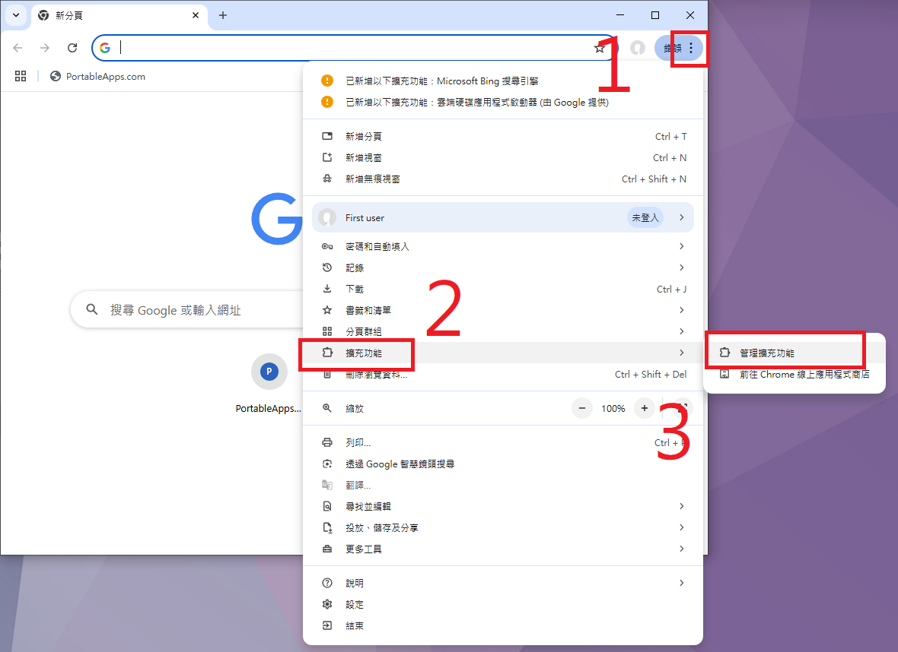
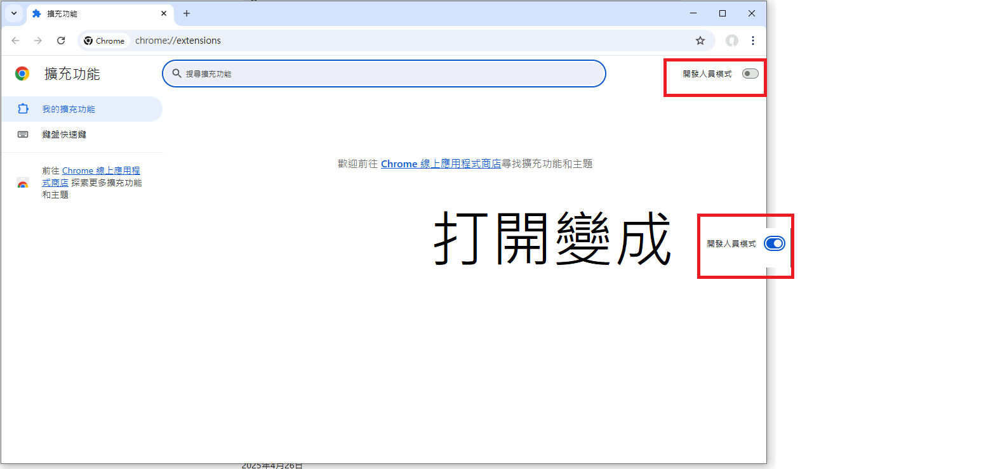
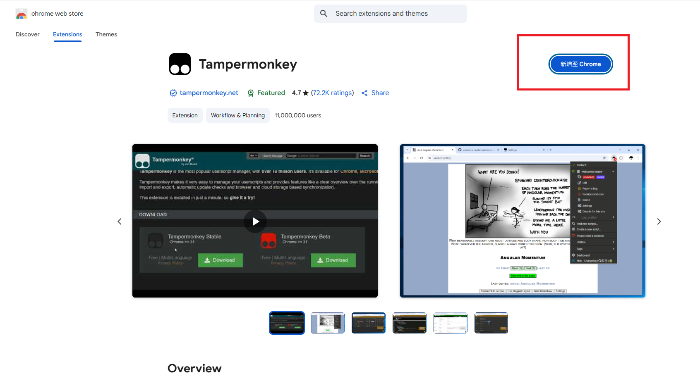
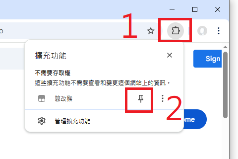
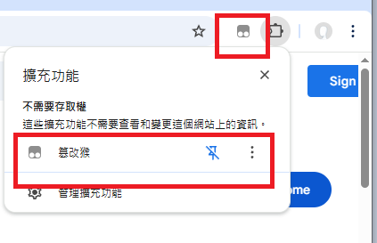
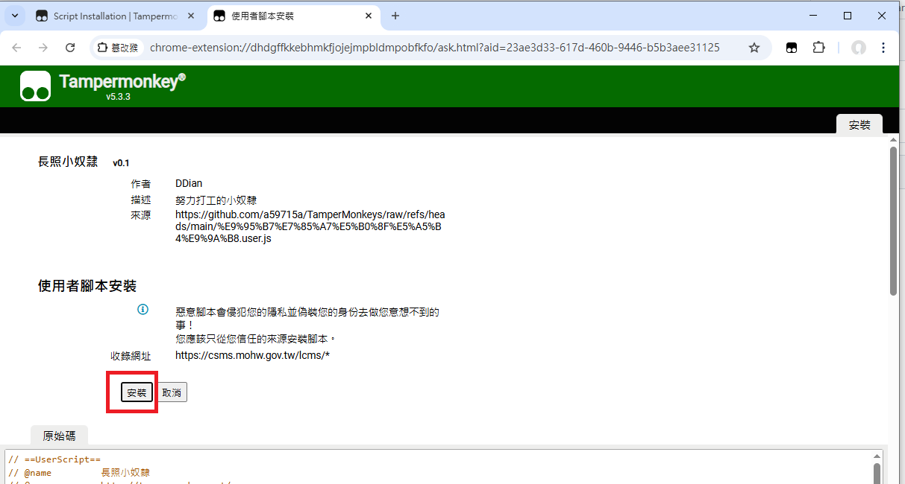

# 安裝教學

## 安裝步驟

1. 安裝 Tampermonkey 擴充功能

   - 開啟 Chrome 瀏覽器
   - 點擊右上角三個點，選擇「更多工具」→「擴充功能」
   - 在擴充功能頁面左上角開啟「開發人員模式」
   - 前往 [Chrome 線上應用程式商店](https://chrome.google.com/webstore/detail/tampermonkey/dhdgffkkebhmkfjojejmpbldmpobfkfo) [https://chrome.google.com/webstore/detail/tampermonkey/dhdgffkkebhmkfjojejmpbldmpobfkfo](https://chrome.google.com/webstore/detail/tampermonkey/dhdgffkkebhmkfjojejmpbldmpobfkfo)
   - 點擊「新增至 Chrome」按鈕進行安裝
   - 
   - 
   - 
   - 
2. 釘選工具

   - 選擴充功能
   - 釘選篡改猴
   - 
   - 
3. 安裝腳本

   - 方法一：直接安裝

     - 點擊 [這裡](https://github.com/a59715a/TamperMonkeys/raw/refs/heads/main/%E9%95%B7%E7%85%A7%E5%B0%8F%E5%A5%B4%E9%9A%B8.user.js) 安裝腳本
     - [https://github.com/a59715a/TamperMonkeys/raw/refs/heads/main/%E9%95%B7%E7%85%A7%E5%B0%8F%E5%A5%B4%E9%9A%B8.user.js](https://github.com/a59715a/TamperMonkeys/raw/refs/heads/main/%E9%95%B7%E7%85%A7%E5%B0%8F%E5%A5%B4%E9%9A%B8.user.js)
     - 在彈出的 Tampermonkey 頁面中點擊「安裝」按鈕

       
   - 方法二：手動安裝

     - 點擊 Tampermonkey 圖示
     - 選擇「建立新腳本」
     - 將腳本內容複製貼上
     - 按 Ctrl + S 儲存
4. 完成安裝

## 注意事項

- 安裝腳本前請確保已開啟開發人員模式
- 如遇到安裝問題，可嘗試重新整理頁面或重新安裝 Tampermonkey
- 請確保網路連線正常，以利功能運作
